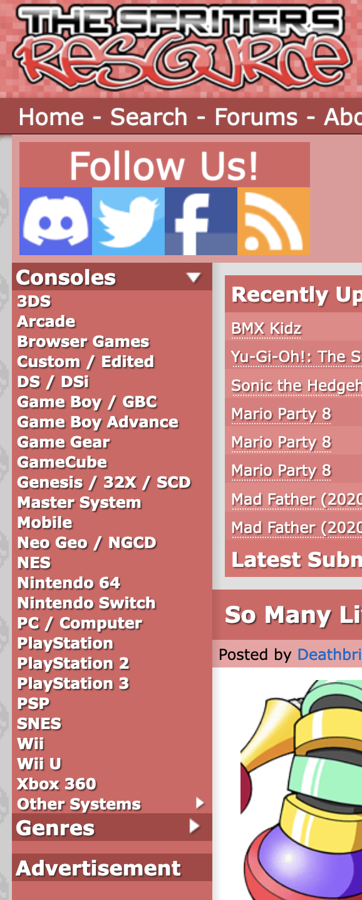

# Desafio de Web Scraping

Este desafio tem por objetivo avaliar as habilidades do candidato para construir rotinas de _Web Scraping_.

## Introdução

Deve-se desenvolver um código que seja capaz de obter uma relação completa de todos os jogos catalogados no site [The Spriters Resource](https://www.spriters-resource.com/). O resultado deve ser um documento JSON que segue a seguinte estrutura:

```json
[
  {
    "console": "Genesis / 32X / SCD",
    "name": "Samurai Shodown",
    "image": "https://www.spriters-resource.com/resources/game_icons/3/2551.png"
  },
  {
    "console": "SNES",
    "name": "Chrono Trigger",
    "image": "https://www.spriters-resource.com/resources/game_icons/1/880.png"
  }
]
```
Os consoles disponíveis podem ser localizados no menu lateral do site, conforme destaca a imagem a seguir.



Para obter os jogos de um console, deve-se selecionar o console desejado. Depois, no topo da página serão apresentadas as letras do alfabeto.


Depois de selecionar uma letra, serão apresentados os nomes dos jogos com suas respectivas imagens.


